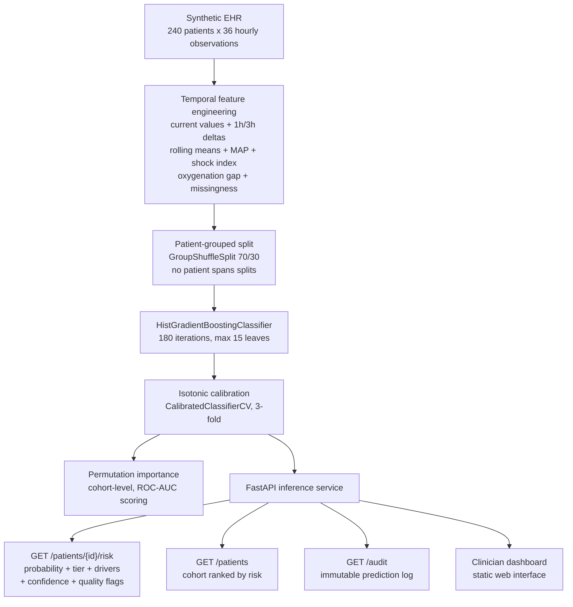

# Clinical Deterioration Early-Warning System

[](https://www.python.org)
[](https://fastapi.tiangolo.com)
[](LICENSE)
[](#build-and-test)

## Overview

<p align="justify">
The Clinical Deterioration Early-Warning System is a clinical decision-support prototype that estimates the probability of physiological deterioration within a six-hour horizon from longitudinal vital-sign data. The system integrates temporal feature engineering, patient-grouped model evaluation, isotonic probability calibration, global and patient-level explainability, uncertainty and data-quality signaling, and an immutable audit trail, exposed through a production-structured FastAPI service with an accompanying clinician-facing dashboard. It is designed as a graduate-level applied machine learning project demonstrating that predictive modeling for high-stakes domains requires substantially more than a fitted classifier: careful temporal framing of the prediction target, leakage-aware validation methodology, calibrated uncertainty quantification, interpretable outputs suitable for human oversight, and an explicit accounting of the boundary between model output and clinical judgment.
</p>

> **Safety disclaimer:** This repository is an educational and research prototype. All patient data is synthetically generated; no real protected health information is present at any stage. The system must not be used for diagnosis, treatment, triage, or any real clinical decision. It is not a medical device and has not undergone clinical validation.

## Key Capabilities

<p align="justify">
<b>Temporal deterioration modeling.</b> Rather than reducing a patient to a static snapshot of current vitals, the system constructs a 46-dimensional representation that captures physiological trajectory: current measurements, one-hour and three-hour changes, three-hour rolling means, mean arterial pressure, shock index (heart rate divided by systolic blood pressure), oxygenation gap, and a missingness count. All temporal features are computed strictly within each patient's own observation timeline, ensuring that no information from one patient contaminates another's representation and that no future information leaks into the features used for a given prediction.
</p>

<p align="justify">
<b>Leakage-aware evaluation protocol.</b> Model assessment is performed under a patient-grouped train/test split implemented with <code>GroupShuffleSplit</code>, guaranteeing that all observations from any single patient reside entirely in either the training set or the test set, never both. This discipline is essential in clinical machine learning: naive row-wise random splitting allows a model to memorize patient-specific baselines seen during training and then recognize the same patients at test time, producing inflated performance estimates that collapse under real deployment. The reported metrics reflect the grouped protocol and are therefore honest estimates of generalization to unseen patients within the synthetic cohort.
</p>

<p align="justify">
<b>Calibrated probabilistic output.</b> The predictive core is a <code>HistGradientBoostingClassifier</code> wrapped in isotonic <code>CalibratedClassifierCV</code>, so the system reports probabilities that are meaningful as probabilities rather than uncalibrated scores. Evaluation covers both discrimination (ROC-AUC, PR-AUC) and calibration quality (Brier score, expected calibration error), because a risk score that discriminates well but is systematically miscalibrated cannot be safely mapped to clinical action thresholds.
</p>

<p align="justify">
<b>Patient-level and cohort-level explainability.</b> Every prediction is accompanied by a ranked list of driving features, each annotated with its direction of influence ("increases risk" or "decreases risk") and its observed value for that patient, produced by a local surrogate procedure that fits per-feature univariate effects on model-evaluated perturbations around the patient's feature vector. Complementing this, global permutation importance computed on the held-out test set characterizes which features the model depends on across the cohort. The system therefore supports both bedside interpretation of individual alerts and aggregate auditing of model behavior.
</p>

<p align="justify">
<b>Clinical workflow integration.</b> The inference API returns calibrated probabilities alongside discrete risk tiers (LOW, MODERATE, HIGH), a confidence assessment, missing-data and data-quality flags, and an explicit clinician-review notice on high-risk predictions stating that the output is not a diagnosis. Each inference event is persisted to a SQLite audit store recording the timestamp, patient identifier, probability, tier, and explanation payload, providing the traceability required for retrospective review of automated decision support.
</p>

## Demonstration

<p align="justify">
The following transcript was captured from a live instance of the service. It shows patient ranking followed by a detailed risk assessment for the highest-ranked patient, including the per-feature drivers behind the prediction.
</p>

```bash
$ uvicorn app.main:app --host 127.0.0.1 --port 8000

$ curl -s http://127.0.0.1:8000/patients | head -c 220
[{"patient_id":"P00010","age":83,"sex":"F",
  "latest_timestamp":"2026-01-02T11:00:00+00:00",
  "deterioration_risk":0.1087,"risk_tier":"LOW"}, ...]

$ curl -s http://127.0.0.1:8000/patients/P00010/risk
{
  "patient_id": "P00010",
  "horizon_hours": 6,
  "risk_probability": 0.1087,
  "risk_tier": "LOW",
  "confidence": "high",
  "quality_flags": [],
  "drivers": [
    {"feature": "temperature_delta3h",
     "direction": "decreases risk", "display_value": "0.13"},
    {"feature": "creatinine_roll3h_mean",
     "direction": "decreases risk", "display_value": "1.07"},
    {"feature": "resp_rate_delta3h",
     "direction": "increases risk", "display_value": "-1.23"},
    {"feature": "shock_index",
     "direction": "decreases risk", "display_value": "0.76"}
  ]
}
```

<p align="justify">
Note that the response carries substantially more than a probability: the horizon the prediction applies to, the discrete tier, the system's confidence in the output given data completeness, any quality concerns, and the specific physiological measurements that moved the estimate in each direction. This structure reflects the design principle that a prediction without provenance is not actionable in a clinical context.
</p>

## System Architecture



## Methodology

<p align="justify">
<b>Synthetic cohort generation.</b> The training and serving data are produced by a seeded, fully deterministic generator (<code>app/ml/synthetic.py</code>) that simulates 240 patients with 36 hourly observations each. Each patient receives an age, sex, comorbidity burden, and baseline vital signs drawn from physiologically plausible distributions. A latent deterioration event is assigned to a subset of patients with probability increasing in comorbidity burden and advanced age; once the event begins, vital signs follow a severity-scaled ramp (rising heart rate, respiratory rate, lactate, and oxygen requirements; falling blood pressure and oxygen saturation) over approximately five hours. Modest missingness is injected, increasing slightly during unstable periods to reflect the reality that measurement gaps correlate with acuity. The binary target indicates whether a deterioration event begins within the subsequent six hours. Because the generator is seeded, the entire dataset — and therefore every reported metric — is exactly reproducible.
</p>

<p align="justify">
<b>Feature engineering.</b> From ten raw vital-sign and laboratory channels (heart rate, systolic and diastolic blood pressure, respiratory rate, oxygen saturation, temperature, lactate, white blood cell count, creatinine, and oxygen flow), the pipeline derives first differences at one- and three-hour lags and three-hour rolling means, all computed within patient groups. It then adds mean arterial pressure, shock index with systolic pressure floored at 50 mmHg to prevent pathological ratios, oxygenation gap (100 minus SpO2), and the count of missing raw channels. Static covariates (age, comorbidity burden) complete the 46-feature vector. Infinite values are sanitized and residual missingness is zero-filled after the temporal features are computed, preserving the distinction between "no change observed" and "measurement absent" upstream of imputation.
</p>

<p align="justify">
<b>Model training and calibration.</b> Training (<code>app/ml/train.py</code>) fits a histogram-based gradient boosting classifier (180 boosting iterations, learning rate 0.055, maximum 15 leaves per tree, L2 regularization 0.7) on the 70% patient-grouped training split, then wraps it in isotonic calibration with three-fold cross-validation so predicted probabilities are empirically grounded. Hyperparameters were selected for stable convergence on the small synthetic cohort rather than maximal leaderboard performance; the emphasis of this project is methodological rigor, not squeezing additional AUC points from synthetic data.
</p>

<p align="justify">
<b>Evaluation.</b> Held-out evaluation on the 30% patient-grouped test split reports discrimination and calibration jointly. The obtained metrics are presented in the Results section below with an explicit statement of their scope: they characterize performance on the synthetic cohort under the grouped protocol and constitute no claim whatsoever about clinical effectiveness.
</p>

<p align="justify">
<b>Explanation generation.</b> Global importance is estimated by permutation importance (five repeats, ROC-AUC scoring) on the test set, with negative importances clipped at zero and the top fifteen features retained. Local explanations perturb the patient's feature vector with scale-adaptive Gaussian noise (160 samples), evaluate the calibrated model on the perturbed set, and fit a univariate linear effect per feature against the centered predictions; the resulting coefficients are ranked by absolute magnitude and the top eight are returned with direction labels and the patient's observed feature values. This procedure is model-agnostic and inexpensive, making it suitable for per-request inference-time use.
</p>

<p align="justify">
<b>Serving correctness.</b> A subtle but critical engineering requirement is that inference-time feature construction must match training-time construction. Temporal features require trailing history; scoring an isolated latest observation would silently zero every delta feature (a train/serve skew defect identified and corrected during independent review). The inference service therefore engineers features over a trailing four-observation window per patient and scores the latest row, guaranteeing that the model observes at inference the same feature semantics it learned during training.
</p>

## API Reference

| Method | Endpoint | Description |
|---|---|---|
| `GET` | `/` | Clinician dashboard (static web interface) |
| `GET` | `/health` | Service liveness and model-load status |
| `GET` | `/model` | Model metadata: version, horizon, features, metrics, training provenance |
| `GET` | `/patients` | All patients with latest risk, ranked by descending probability |
| `GET` | `/patients/{patient_id}/risk` | Full risk assessment: probability, tier, confidence, flags, drivers, measurements |
| `GET` | `/audit` | Recent prediction audit records (timestamp, patient, probability, tier, drivers) |
| `GET` | `/docs` | Auto-generated interactive API documentation (Swagger UI) |

<p align="justify">
All responses are validated against pydantic schemas (<code>app/api/schemas.py</code>), so the API contract is machine-enforced rather than documented by convention. Unknown patient identifiers return HTTP 404 with a descriptive message.
</p>

## Results

<p align="justify">
The following metrics were obtained by retraining from the deterministic seed and evaluating on the held-out 30% patient-grouped test split (positive rate approximately 6%). They are demonstration metrics on synthetic data, reported to establish reproducibility rather than to suggest clinical utility.
</p>

| Metric | Value | Interpretation |
|---|---|---|
| ROC-AUC | **0.6493** | Modest discrimination; expected given the subtle early-trajectory signal in synthetic data |
| PR-AUC | **0.1291** | Low absolute value reflecting the ~6% positive rate; well above the 0.06 random baseline |
| Brier score | **0.0556** | Low overall probabilistic error, aided by the low base rate |
| Expected calibration error | **0.0241** | Predicted probabilities track observed frequencies closely across deciles |

<p align="justify">
The calibration result is arguably the most important row in this table: a decision-support system whose probabilities are miscalibrated cannot be mapped to action thresholds, regardless of its discrimination. The isotonic calibration layer keeps the expected calibration error near two percentage points, which is the behavior one wants before any threshold policy is layered on top.
</p>

## Project Layout

```text
app/main.py                 FastAPI application, route definitions, startup lifespan
app/api/schemas.py          Pydantic request/response schemas enforcing the API contract
app/core/config.py          Path resolution, environment configuration
app/ml/synthetic.py         Seeded synthetic EHR cohort generator
app/ml/features.py          Temporal feature engineering pipeline
app/ml/train.py             Grouped splitting, model fitting, calibration, evaluation
app/ml/explain.py           Global permutation importance and local surrogate explanations
app/services/model_service.py  Inference service: feature construction, scoring, tiering
app/services/audit.py       SQLite-backed immutable prediction audit store
app/web/dashboard.html      Clinician-facing dashboard (patient ranking, risk detail)
scripts/train.py            Reproducible training entrypoint
tests/test_api.py           Endpoint contract and inference tests
tests/test_features.py      Temporal feature correctness tests
tests/test_synthetic.py     Generator determinism tests
Dockerfile                  Container image definition
docker-compose.yml          Single-command deployment
```

## Build and Test

```bash
pip install -r requirements.txt
python scripts/train.py --output models
python -m pytest -q
uvicorn app.main:app --host 127.0.0.1 --port 8000
# or, containerized:
docker compose up --build
```

<p align="justify">
On first startup, if no trained artifacts are present, the application lifespan automatically generates the synthetic cohort and trains the model before serving traffic, so a fresh clone is runnable with no manual data preparation. The trained model binary, metadata, and dataset snapshots are excluded from version control by convention (see <code>.gitignore</code>) and are treated as reproducible build artifacts.
</p>

## Deliberate Scope Boundaries

<p align="justify">
This prototype is explicit about what it does not claim. All patient data is synthetic, generated from a seeded simulator; no real protected health information exists anywhere in the repository, the training pipeline, or the served artifacts. The model has never observed real clinical data and possesses no clinical validity; the reported metrics describe behavior on the synthetic cohort under the grouped evaluation protocol and must not be interpreted as evidence of real-world performance. The system includes no electronic health record integration (no FHIR or SMART-on-FHIR interfaces), no real-time streaming ingestion, no concept-drift monitoring, and no prospective or external validation. These are documented roadmap items rather than implied capabilities, and the repository is structured so that each can be added without misrepresenting the current state of the system.
</p>

## Roadmap

<p align="justify">
The natural evolution of this prototype toward a defensible research contribution proceeds through external validation on MIMIC-IV followed by temporal validation on a held-out time period; subgroup and fairness analysis across age, sex, and comorbidity strata; replacement of the local surrogate with SHAP values and counterfactual explanations; decision-curve analysis to quantify clinical utility across threshold policies; explicit modeling of alert fatigue under realistic alerting cadences; online drift monitoring for feature and prediction distributions; and FHIR/SMART-on-FHIR integration for standards-based EHR interoperability. Each of these steps addresses a distinct gap between a well-engineered prototype and a system that could responsibly participate in clinical workflows.
</p>

## Resume Bullet

<p align="justify">
Built an explainable clinical deterioration early-warning prototype in Python and FastAPI that predicts six-hour deterioration risk from vital-sign time series, featuring patient-grouped leakage-aware evaluation, isotonic probability calibration, per-patient explanations with directional drivers, data-quality and confidence signaling, SQLite audit logging, and a clinician dashboard; verified end-to-end with automated tests and a live API smoke test.
</p>

## License

<p align="justify">
Distributed under the MIT License. See <code>LICENSE</code> for the full text.
</p>
