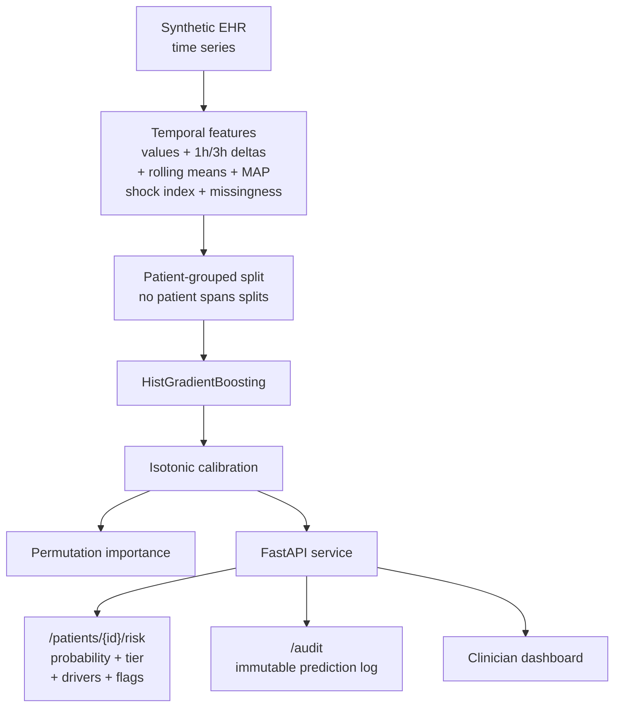

# Clinical Deterioration Early-Warning System

[](https://www.python.org)
[](https://fastapi.tiangolo.com)
[](LICENSE)
[](#build--test)

A clinical decision-support prototype that predicts **physiological
deterioration within a 6-hour horizon** from vital-sign time series. It
combines temporal feature engineering, patient-grouped evaluation,
probability calibration, patient-level explanations, and an auditable REST
API with a clinician-facing dashboard.

> **Safety disclaimer:** educational prototype. Uses synthetic patient
> data. Not for diagnosis, treatment, triage, or real clinical decisions.
> Not a medical device, not clinically validated.

## Demo

```bash
$ uvicorn app.main:app --host 127.0.0.1 --port 8000
$ curl -s http://127.0.0.1:8000/patients | head -c 200
[{"patient_id":"P00010","age":83,"sex":"F","latest_timestamp":"2026-01-02T11:00:00+00:00",
  "deterioration_risk":0.1087,"risk_tier":"LOW"}, ...]

$ curl -s http://127.0.0.1:8000/patients/P00010/risk
{
  "patient_id": "P00010",
  "horizon_hours": 6,
  "risk_probability": 0.1087,
  "risk_tier": "LOW",
  "confidence": "high",
  "quality_flags": [],
  "drivers": [
    {"feature": "temperature_delta3h", "direction": "decreases risk", "display_value": "0.13"},
    {"feature": "creatinine_roll3h_mean", "direction": "decreases risk", "display_value": "1.07"},
    {"feature": "resp_rate_delta3h", "direction": "increases risk", "display_value": "-1.23"},
    {"feature": "shock_index", "direction": "decreases risk", "display_value": "0.76"}
  ]
}
```

The API never returns just a number: every prediction ships with its
drivers (which features pushed risk up or down, and their observed
values), a confidence level, data-quality flags, and an audit record.

## Architecture



## Design

**Temporal, not tabular.** Each prediction uses the current observation
plus 1-hour and 3-hour changes, 3-hour rolling means, MAP, shock index
(HR/SBP), oxygenation gap, and a missingness count — 46 features total.
Deltas are computed within each patient's own timeline, never across
patients.

**Leakage-aware evaluation.** Splits are done by patient ID with
`GroupShuffleSplit`, so no patient's observations appear in both train
and test. Random row-wise splitting would inflate every metric and mean
nothing.

**Calibrated probabilities.** `HistGradientBoostingClassifier` wrapped in
isotonic `CalibratedClassifierCV`. Both discrimination and calibration
are reported:

| Metric | Value |
|---|---:|
| ROC-AUC | 0.6493 |
| PR-AUC | 0.1291 |
| Brier score | 0.0556 |
| Expected calibration error | 0.0241 |

These are **synthetic demonstration metrics** (5–6% positive rate), not
claims of clinical performance. They are reported so the evaluation can
be reproduced, not to impress.

**Explainability.** Global permutation importance shows what the model
relies on across the cohort; a local surrogate (per-feature univariate
fit on perturbed samples) explains each individual prediction with
direction ("increases risk" / "decreases risk") and observed values.

**Workflow honesty.** The API returns risk tiers (LOW / MODERATE / HIGH),
confidence levels, missing-data warnings, and an explicit
"requires clinician review — this is not a diagnosis" flag on high-risk
predictions. Every inference is written to a SQLite audit log.

## Project layout

```text
app/main.py              FastAPI app, routes, lifespan
app/api/schemas.py       pydantic response models
app/core/config.py       paths and environment
app/ml/synthetic.py      deterministic synthetic EHR generator
app/ml/features.py       temporal feature engineering
app/ml/train.py          grouped split, calibration, metrics
app/ml/explain.py        global + local explanations
app/services/            inference service, audit store
app/web/dashboard.html   clinician dashboard
scripts/train.py         reproducible training entrypoint
tests/                   API, features, synthetic determinism
```

## Build & test

```bash
pip install -r requirements.txt
python scripts/train.py --output models
python -m pytest -q
uvicorn app.main:app --host 127.0.0.1 --port 8000
# or
docker compose up --build
```

## Deliberate scope boundaries

- All patient data is synthetic (seeded generator, fully reproducible).
  No real PHI anywhere.
- The model has not seen real clinical data and has no clinical
  validity; metrics describe the synthetic cohort only.
- No EHR integration (no FHIR), no real-time streaming ingestion, no
  drift monitoring — those are roadmap items, not claims.

## Roadmap

1. External validation on MIMIC-IV, then temporal validation.
2. Subgroup and fairness analysis across age/sex/comorbidity strata.
3. SHAP + counterfactual explanations replacing the local surrogate.
4. Decision-curve analysis and alert-fatigue modeling.
5. Drift monitoring and FHIR/SMART-on-FHIR integration.

## Resume bullet

> Built an explainable clinical deterioration early-warning prototype in
> Python/FastAPI predicting 6-hour deterioration risk from vital-sign
> time series, with patient-grouped evaluation, isotonic calibration,
> per-patient explanations, audit logging, and a clinician dashboard.

## License

MIT.
